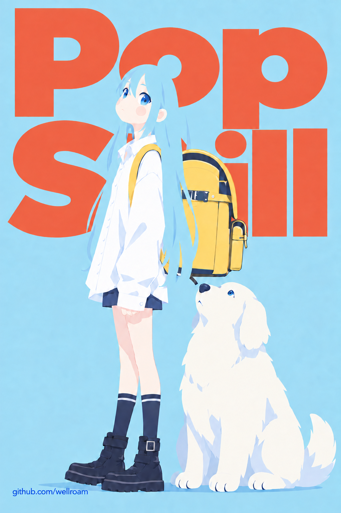
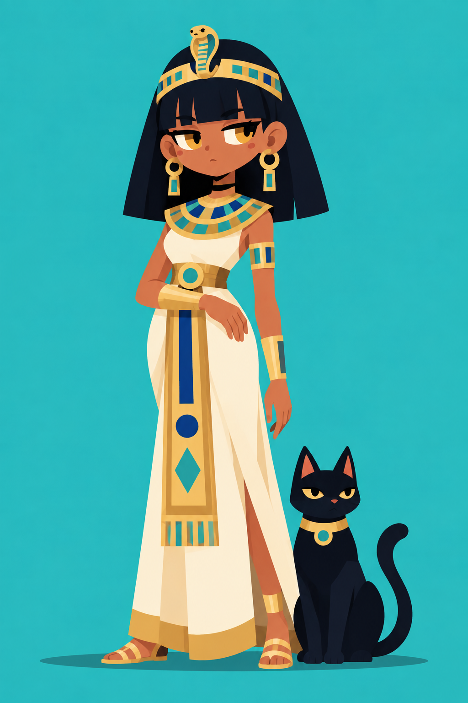
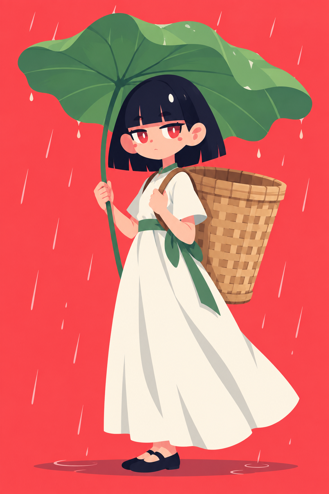

# Flat Pop Character · 潮流扁平角色插画

<p align="center">
  
</p>

一个用于 Codex 的图像生成 Skill。给出主题、人物造型、主色和次色，即可让 ImageGen 结合内置参考图，创作具有鲜明色块、夸张发型和生动眼神的角色插画。

适合冷感肖像、可爱头像、全身角色，以及带少量道具或装饰的主题插画。人物身份、服装、姿态和配色可以自由变化。

## 作品示例

<table>
  <tr>
    <th>埃及女王与黑猫</th>
    <th>撑荷叶伞的姑娘</th>
  </tr>
  <tr>
    <td></td>
    <td></td>
  </tr>
</table>

画法以大色块和清晰剪影为基础，省略或弱化外描边，用少量内部线条表达眼睑与结构。简洁的平面阴影保持形体清楚，局部可以保留轻微渐变或纸感。

## 安装

在 Codex 中发送：

```text
请从 https://github.com/wellroam/flat-pop-character-skill 安装这个 Skill，
安装名称使用 artifact-template-flat-pop-character。
仓库根目录就是 Skill 目录，请保留其中的参考图片和其他资源。
```

仓库名称是 `flat-pop-character-skill`，安装目录和调用名称是 `artifact-template-flat-pop-character`。两者不同，安装时不要直接沿用仓库名称作为 Skill 名称。

本 Skill 使用 `$imagegen` 的内置 ImageGen 工作流，需要所在 Codex 环境提供该能力。使用内置工具时，不需要另外配置 API key。

## 四项创作输入

安装后，使用 `$artifact-template-flat-pop-character` 显式调用，并提供以下信息：

| 输入 | 说明 | 示例 |
| --- | --- | --- |
| 主题 | 人物在做什么、情境与氛围 | 夏日小雨中的片刻停留 |
| 人物造型 | 身份、发型、服装、姿态和关键配件 | 短发姑娘，长裙，背着竹篓 |
| 主色 | 主导颜色，以及用于哪里 | 荷叶绿，用于大荷叶和裙装细节 |
| 次色 | 辅助颜色，以及用于哪里 | 暖象牙白，用于长裙 |

主次色描述的是颜色分工，不代表整幅画只能使用两种颜色。肤色、深色结构色和必要点缀仍可加入，也可以明确要求限制总色数。

不用先写完整提示词。一句自然描述也可以；拿不准的项目可以直接说“你来定”“参考图取色”或“其余自由发挥”。信息已齐全时会直接生成，缺少核心信息时才集中补问。

## 可直接使用的示例

### 埃及女王与黑猫

```text
使用 $artifact-template-flat-pop-character。
主题：埃及女王与她的黑猫，安静而有威严。
人物造型：齐刘海黑色短发、暖棕肤色，戴简洁的眼镜蛇金冠、
宽项圈与金色腕饰，穿象牙色及金色拼接的长裙；一只黑猫坐在脚边。
主色：暖金色，用于头饰、项圈、腰带、腕饰和裙装色块。
次色：青绿色，用于纯色背景和少量饰品镶嵌。
构图：一人一猫，全身竖版 2:3，完整保留头饰、鞋子和猫尾，不要文字。
参考库中的埃及女王图，保留这种画法，创作新的姿态和细节组合。
```

### 撑荷叶伞的姑娘

```text
使用 $artifact-template-flat-pop-character。
主题：夏日小雨，姑娘用一片大荷叶遮雨，安静又带一点童话感。
人物造型：齐刘海黑色短发，穿长裙和平底鞋，背着大大的竹篓；
一只手握住连着荷叶的茎，另一只手扶着肩带，身体略微侧转。
主色：荷叶绿，用于头顶的大荷叶和裙装细节。
次色：暖象牙白，用于长裙；竹篓使用自然竹色。
背景：珊瑚红，少量简洁雨线。
构图：全身竖版 2:3，完整展示荷叶、叶茎、竹篓和鞋子，不要文字。
参考库中的撑荷叶伞姑娘图；荷叶本身就是伞，不添加普通雨伞。
```

这些描述可以作为起点，替换主题、人物或颜色即可创作其他角色。

## 参考图如何使用

内置八张参考：埃及女王、撑荷叶伞的姑娘、蓝衣少年、骑扫帚的女巫，以及潮流肖像、可爱头像、简洁全身角色和装饰场景四张原始参考。

- 可以点名使用某张参考，也可以让 Skill 按主题、造型和构图选择最相关的一至两张。
- 八张图均可作为风格依据，不设固定的风格优先级。背书包女孩用于 README 和模板图库封面，不计入八张风格参考，也不默认传入生成。
- 参考图提供画法，不会默认把黑猫、荷叶伞、竹篓、头盔、女巫帽、扫帚或整套服装配色带入新主题。
- 图片中的署名、平台标记和水印不作为生成内容；人物、道具和背景仍以本次要求为准。

每张参考的用途见 [风格指南](references/style-guide.md)。

## 默认输出与后续修改

- 默认生成一张无文字的单幅插画，采用干净背景。
- 未指定用途和取景时，使用单人全身竖版，建议比例为 **2:3**；头像默认 **1:1**。
- 可以明确指定半身、其他比例、人数或多张独立图片；需要文字时提供准确文案。

继续修改时，说清改变什么、保留什么即可：

```text
把刚才的姑娘改成回头看向镜头，保留发型、长裙、荷叶伞、竹篓和配色。
仍然是全身竖版，不要文字。
```

Skill 会沿用已确认的创作输入，只补充本次修改需要的信息。编辑结果使用新文件名保存，保留原作；交付时展示成图，并说明保存位置、主次色用途和最终提示词。

完整行为说明见 [SKILL.md](SKILL.md)。
